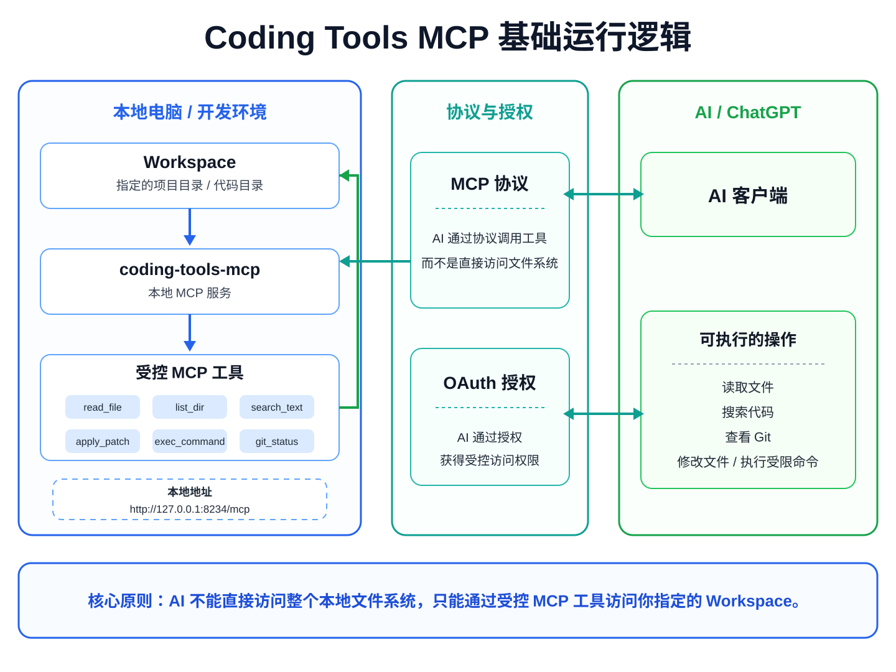

# Coding Tools MCP 使用文档

这份文档只讲如何使用 Coding Tools MCP。

如果你想先了解项目适合谁、解决什么问题，请查看项目根目录的 `README.md`。

如果你需要配置 Cloudflare、FRP、ngrok、Tailscale 或自定义公网地址，请查看：

[网络提供商安装与部署教程（新手版）](NETWORK_PROVIDER_BEGINNER_GUIDE.md)

## 1. 使用前准备

你需要准备：

- 一台 macOS、Windows 或 Linux 电脑
- 一个需要 AI 协助的本地项目目录
- 一个支持 Remote MCP 的 AI 客户端
- 至少一种可以让 AI 客户端访问本地 MCP 服务的网络方案

例如你的项目目录：

```text
/Users/me/Projects/my-app
```

这个目录就是后面要选择的 Workspace。

## 2. 启动桌面程序

打开 Coding Tools MCP 桌面程序后，主要会看到：

```text
Workspace
Password
高级 OAuth 设置
网络方案
网络方案对应的配置区域
运行状态
Public MCP URL
运行日志
```

普通用户主要只需要关注：

```text
Workspace
Password
网络方案
```

## 3. 选择 Workspace

在 `Workspace` 一栏选择希望 AI 操作的项目目录。

例如：

```text
/Users/me/Projects/my-app
```

选择后，MCP 的文件读取、搜索、修改和命令操作都会以这个目录为主要边界。

建议：

- 一个项目选择一个 Workspace
- 不要直接选择整个用户主目录
- 不要选择磁盘根目录
- 启动前确认路径是否是当前真正想让 AI 操作的项目

## 4. 设置 OAuth Password

`Password` 是 MCP OAuth 授权页面使用的登录密码。

建议使用随机且不容易猜到的密码。

普通用户不需要填写：

```text
Client ID
Client Secret
```

支持 Dynamic Client Registration 的 MCP Client 会在连接时动态注册自己的 Client ID。

## 5. 高级 OAuth 设置

界面中的：

```text
高级 OAuth 设置（预注册 Client）
```

默认关闭即可。

只有在使用不支持 Dynamic Client Registration 的 MCP Client 时，才需要开启并填写：

```text
Client ID
Client Secret
```

这里的 Client ID 是 Coding Tools MCP 自己的 OAuth Client ID，不是 Cloudflare Connector ID、Tunnel ID 或其他网络服务的设备 ID。

如果不确定是否需要，保持关闭。

## 6. 选择网络方案

桌面端目前支持：

```text
Cloudflare Tunnel
FRP
ngrok
Tailscale Funnel
自定义公网 URL
```

如果不知道如何选择，可以参考：

| 你的情况 | 推荐方案 |
|---|---|
| 第一次测试 | Cloudflare Quick Tunnel |
| 已有 Cloudflare 域名 | Cloudflare Named Tunnel |
| 有自己的 VPS | FRP |
| 想临时快速得到公网 URL | ngrok |
| 已经使用 Tailscale | Tailscale Funnel |
| 已有 Nginx/Caddy/反向代理 | 自定义公网 URL |

完整部署步骤见：

[网络提供商安装与部署教程（新手版）](NETWORK_PROVIDER_BEGINNER_GUIDE.md)

## 7. FRP、ngrok、Tailscale 客户端检测

FRP、ngrok 和 Tailscale 页面提供客户端检测能力。

一般会看到：

```text
[自动检测] [选择…]
```

点击 `自动检测` 后，程序会尝试从应用内置客户端、标准安装目录和系统 PATH 中寻找对应程序。

程序不会递归扫描整块硬盘。

检测成功后会显示类似：

```text
已检测
版本: 3.x.x
来源: 标准安装目录
路径: /opt/homebrew/bin/ngrok
```

如果自动检测失败，可以点击 `选择…` 手动指定可执行文件。

## 8. 启动 MCP

完成 Workspace、Password 和网络配置后，点击：

```text
启动 MCP
```

程序会准备网络连接和本地 MCP 服务。

启动过程中状态会显示 `Starting`。

启动成功后显示：

```text
● Running
```

状态文字和圆点为绿色。

同时界面会显示 `Public MCP URL`，例如：

```text
https://mcp.example.com/mcp
```

或者某个网络方案自动生成的 HTTPS 地址。

## 9. 把 Public MCP URL 添加到 AI 客户端

复制桌面端显示的 `Public MCP URL`。

在支持 Remote MCP 的 AI 客户端中新增 MCP Server，并填写这个 URL。

第一次连接时，AI 客户端通常会进入 OAuth 授权流程。

浏览器出现授权页面后，输入桌面端配置的 `Password` 完成授权。

授权成功后，AI 客户端就可以看到 Coding Tools MCP 提供的工具。

## 10. AI 可以做什么

连接成功以后，AI 可以通过 MCP 工具协助完成：

- 读取文件
- 浏览目录
- 搜索代码
- 修改源码
- 应用 Patch
- 查看 Git Status
- 查看 Git Diff
- 查看 Git Log
- 查看 Commit 内容
- Git Blame
- 执行受控命令
- 管理运行中的命令
- 查看图片文件

AI 使用的是 MCP 工具，而不是直接获得电脑的任意磁盘访问权限。

## 11. 查看运行日志

桌面程序底部提供运行日志区域。

如果启动失败，优先查看这里。

常见日志来源包括：

```text
coding-tools-mcp
cloudflared
frpc
ngrok
tailscale
```

日志可以用于判断 MCP 是否启动、网络客户端是否连接、公网 URL 是否生成以及 OAuth 是否存在配置错误。

## 12. 停止 MCP

服务运行时，按钮会变成：

```text
停止 MCP
```

点击后程序会停止本地 MCP 服务，并关闭由当前 Provider 启动的网络进程。

停止成功后状态显示：

```text
● Stopped
```

状态文字和圆点为红色。

## 13. 保存配置

桌面程序会保存普通配置，例如 Workspace、当前网络方案、Public URL、FRP 配置文件路径和用户手动选择的客户端路径。

如果勾选：

```text
在这台电脑上保存敏感凭据
```

还会保存对应的 OAuth Password、Cloudflare Tunnel Token、ngrok Auth Token 等敏感字段。

如果不希望本机保存这些内容，可以关闭该选项。

## 14. CLI 使用

除了桌面版，也可以使用 CLI：

```bash
python -m coding_tools_launcher.cli /path/to/workspace
```

CLI 会从 `.env` 读取 OAuth 和网络配置。

可以复制：

```bash
cp .env.example .env
```

普通用户优先推荐桌面版，CLI 更适合开发调试、自动化启动和远程开发环境。

## 15. 常见问题

### 启动后没有 Public MCP URL

先查看运行日志，确认网络 Provider 是否成功启动。

不同网络方案的排查方式见：

[网络提供商安装与部署教程（新手版）](NETWORK_PROVIDER_BEGINNER_GUIDE.md)

### 提示找不到 frpc、ngrok 或 tailscale

先点击对应页面的 `自动检测`。如果仍然找不到，确认客户端已经安装，再点击 `选择…` 手动指定可执行文件。

### Tailscale 明明有路径却检测失败

找到一个 `tailscale` 文件并不代表 Tailscale 当前可用。程序还会验证版本和运行状态；如果 Tailscale App 已卸载但系统中残留旧 wrapper，也会被拒绝。

### AI 无法读取 Workspace 以外的文件

这是预期行为。如果确实需要操作另一个项目，请停止当前服务并重新选择正确的 Workspace。

### Client ID 应该填什么

普通用户不需要填写，保持“高级 OAuth 设置”关闭即可。

## 16. 安全建议

- Workspace 只选择当前项目目录
- 不要选择 `/`、`C:\` 或整个 Home 目录
- 不要把 Token、Password、Secret 提交到 Git
- 对重要项目保持 Git 提交或备份
- 执行高影响命令前确认 AI 当前操作的 Workspace
- 公网 MCP 地址只提供给需要使用的客户端

## 17. 进一步阅读

- [网络提供商安装与部署教程（新手版）](NETWORK_PROVIDER_BEGINNER_GUIDE.md)
- [NetworkProvider 架构与开发说明](NETWORK_PROVIDERS.md)
- [MCP Server 开发文档](MCP_SERVER_DEVELOPMENT.md)

基础运行逻辑示意图：


